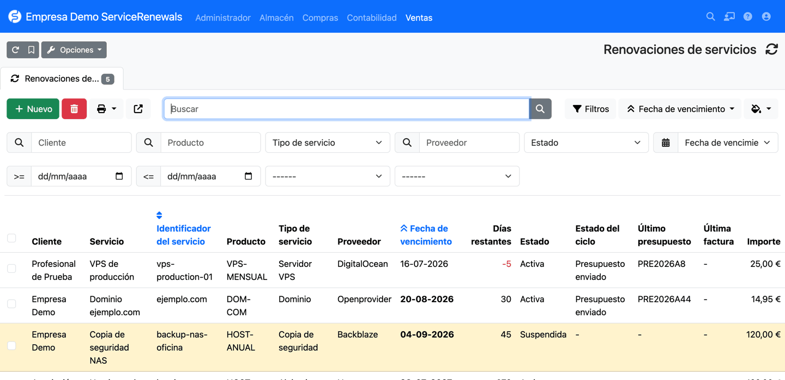
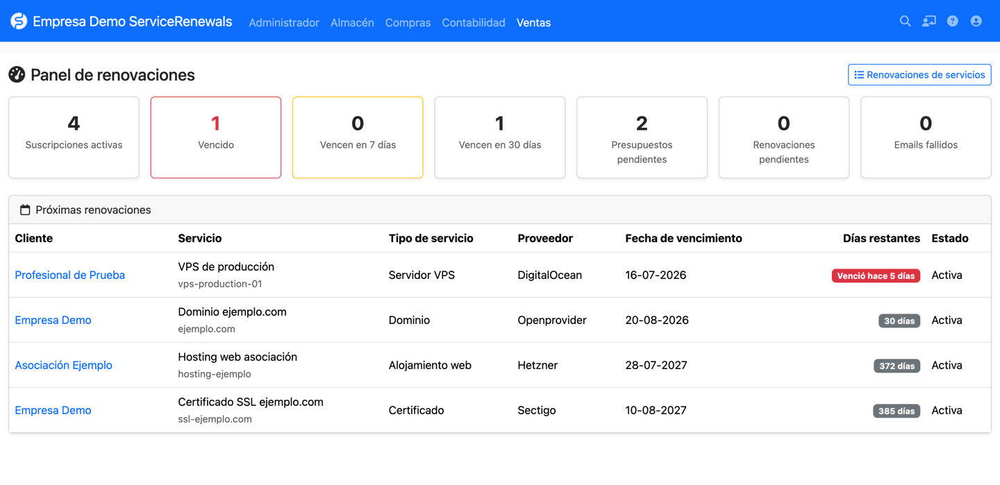

# ServiceRenewals para FacturaScripts

Plugin para FacturaScripts que gestiona renovaciones de dominios, alojamientos,
servidores y otros servicios, genera presupuestos y envía avisos automáticos
antes del vencimiento.

<a href="https://erseco.github.io/facturascripts-playground/?blueprint=https%3A%2F%2Fraw.githubusercontent.com%2Ferseco%2Ffacturascripts-plugin-ServiceRenewals%2Frefs%2Fheads%2Fmain%2Fblueprint.json">
  
</a><br>
<small><a href="https://erseco.github.io/facturascripts-playground/?blueprint=https%3A%2F%2Fraw.githubusercontent.com%2Ferseco%2Ffacturascripts-plugin-ServiceRenewals%2Frefs%2Fheads%2Fmain%2Fblueprint.json">Probar en FacturaScripts Playground</a></small>



## El problema que resuelve

Si vendes servicios recurrentes (dominios, hosting, VPS, certificados SSL,
mantenimientos, licencias, copias de seguridad...), cada servicio tiene su
propia fecha de vencimiento y renovarlo a tiempo depende de acordarse. Este
plugin registra cada servicio contratado, avisa antes del vencimiento, genera
el presupuesto de renovación, lo envía por email y, cuando el presupuesto se
convierte en factura, avanza la fecha de vencimiento automáticamente.

## Características

- Perfiles de renovación por producto: periodicidad, antelación del
  presupuesto, días de recordatorio y política de renovación.
- Suscripciones por cliente con el identificador concreto del servicio
  (`ejemplo.com`, `vps-production-01`...), el proveedor y la fecha real de
  vencimiento.
- Generación automática del presupuesto de renovación con la línea del
  producto, el identificador y el periodo cubierto.
- Envío del presupuesto en PDF por email, con reintentos y registro de
  errores.
- Recordatorios configurables (por ejemplo 15, 7 y 3 días antes).
- Detección automática de la transformación del presupuesto en factura.
- Renovación automática al facturar, o con confirmación manual.
- Historial completo de ciclos y notificaciones por suscripción.
- Panel de resumen y listado con filtros por cliente, producto, tipo,
  proveedor, estado y vencimiento.
- Pestañas de renovaciones en las fichas de cliente y de producto.



## Modelo: producto, suscripción y ciclo

El plugin separa tres conceptos (ver `docs/adr/0001`):

- El **producto** contiene la definición reutilizable y sus valores
  predeterminados («Renovación de dominio .com», 12 meses, avisar 30 días
  antes). **La fecha de vencimiento nunca se guarda en el producto.**
- La **suscripción** es el servicio contratado por un cliente concreto, con
  su identificador, su proveedor y **su fecha real de vencimiento**. Puede
  sobrescribir cualquier valor del perfil.
- El **ciclo** es el historial de una renovación concreta: presupuesto
  generado, factura detectada y avance de fecha aplicado. Una suscripción
  genera como máximo un presupuesto por ciclo, aunque el cron se ejecute
  muchas veces.

## Requisitos

- FacturaScripts 2025 o superior.
- PHP 8.1 o superior.
- El cron de FacturaScripts configurado (obligatorio para las
  automatizaciones).
- Un servidor SMTP configurado en FacturaScripts para los envíos de email.

## Instalación

1. Descarga el ZIP desde la forja de plugins de FacturaScripts o desde las
   releases de GitHub.
2. En FacturaScripts, ve a **Administración → Plugins**, sube el ZIP y
   activa **ServiceRenewals**.
3. Configura el cron si aún no lo has hecho (ver siguiente sección).

## Configuración del cron

Las automatizaciones (detección de vencimientos, presupuestos, emails y
renovaciones) se ejecutan mediante el cron nativo de FacturaScripts. Añade a
tu crontab una entrada como:

```cron
0 * * * * cd /ruta/a/facturascripts && php index.php -cron
```

Sin cron, el plugin sigue funcionando de forma manual (botones «Generar
presupuesto», «Enviar aviso» y «Confirmar renovación»), pero no habrá avisos
ni renovaciones automáticas.

## Configuración

En **Administración → Renovaciones de servicios** puedes ajustar:

- Activar o desactivar el procesamiento automático.
- Días de antelación predeterminados para generar el presupuesto.
- Días de recordatorio predeterminados (lista separada por comas: `15,7,3`).
- Envío automático del presupuesto por email.
- Política de renovación predeterminada (al facturar o manual).
- Asunto y cuerpo de los emails de presupuesto y de recordatorio.
- CC y BCC globales, email remitente y número máximo de reintentos.

### Plantillas de email y marcadores

Las plantillas son de texto plano y admiten estos marcadores:

| Marcador | Contenido |
|---|---|
| `{{client_name}}` | Nombre o razón social del cliente |
| `{{service_title}}` | Título del servicio (o su identificador) |
| `{{service_identifier}}` | Identificador del servicio (`ejemplo.com`) |
| `{{service_type}}` | Tipo de servicio traducido |
| `{{provider_name}}` | Proveedor o registrador |
| `{{expiration_date}}` | Fecha de vencimiento actual |
| `{{next_expiration_date}}` | Fecha tras la renovación |
| `{{quote_code}}` | Código del presupuesto |
| `{{quote_total}}` | Importe total del presupuesto |
| `{{company_name}}` | Nombre de tu empresa |

Los marcadores desconocidos se conservan visibles en el texto y quedan
registrados en el log para que el error no pase desapercibido.

## Uso paso a paso

1. Crea (o abre) un producto del servicio, por ejemplo «Renovación de
   dominio .com», y en su pestaña **Perfil de renovación** define la
   periodicidad y los avisos.
2. Crea una suscripción en **Ventas → Renovaciones de servicios → Nuevo**:
   cliente, producto, identificador (`ejemplo.com`), proveedor y fecha de
   vencimiento.
3. El cron detecta la suscripción cuando entra en el umbral de antelación,
   abre un ciclo y genera el presupuesto.
4. Si el envío automático está activo, el presupuesto se envía por email al
   cliente con el PDF adjunto.
5. Cuando el cliente acepta, transforma el presupuesto en factura desde
   FacturaScripts (directamente o vía pedido/albarán).
6. El siguiente paso del cron detecta la factura y renueva la suscripción:
   la fecha de vencimiento avanza el periodo configurado.
7. Con la política manual, el ciclo queda «Pendiente de confirmar» y la
   fecha solo avanza al pulsar **Confirmar renovación**.

## Estados

- **Suscripción**: activa, suspendida, cancelada, vencida. Una suscripción
  suspendida o cancelada no genera documentos ni emails.
- **Ciclo**: pendiente, presupuesto creado, presupuesto enviado, facturado,
  pendiente de confirmar, renovado, fallido, cancelado.
- **Notificación**: pendiente, enviado, fallido, cancelado.

## Desarrollo

El entorno de desarrollo usa Docker (FacturaScripts + MariaDB + Mailpit):

```bash
make upd     # levanta el entorno en http://localhost:8080 (admin/admin)
make cron    # ejecuta el cron una vez (procesa renovaciones y emails)
make logs    # muestra los logs
```

Mailpit captura todos los emails en http://localhost:8025.

### Comandos Make

| Comando | Descripción |
|---|---|
| `make up` / `make upd` | Arranca el entorno (interactivo / en segundo plano) |
| `make down` / `make clean` | Para el entorno / además borra los volúmenes |
| `make fresh` | Entorno limpio desde cero |
| `make shell` | Shell dentro del contenedor |
| `make cron` | Ejecuta el cron de FacturaScripts una vez |
| `make lint` | PHP CodeSniffer (PSR-12) |
| `make format` | PHP CS Fixer |
| `make test` | PHPUnit dentro del contenedor |
| `make package VERSION=1` | Genera `dist/ServiceRenewals-1.zip` |

### Tests

```bash
make upd
make test
```

Los tests unitarios de fechas y plantillas no necesitan base de datos; los
de integración (ciclos, presupuestos, notificaciones, renovación) se
ejecutan dentro del contenedor contra una instalación real. Ningún test
necesita un servidor SMTP real.

### Empaquetado

```bash
make package VERSION=1
unzip -l dist/ServiceRenewals-1.zip   # la carpeta raíz es ServiceRenewals/
```

Las releases oficiales se crean etiquetando (`git tag 1.0 && git push --tags`);
GitHub Actions construye el ZIP y lo publica en GitHub y en la forja.

## Limitaciones de la primera versión

- No renueva dominios ni servicios en el registrador o proveedor: la
  renovación real (técnica) sigue siendo cosa tuya.
- No realiza cobros automáticos ni integra pasarelas de pago.
- Cada ciclo genera como máximo un presupuesto por suscripción; no agrupa
  varias suscripciones en un mismo presupuesto.
- La renovación se dispara al facturar o manualmente; no al cobro.
- Los recordatorios se disparan el día exacto configurado, por lo que el
  cron debe ejecutarse a diario.

## Hoja de ruta

- Renovación al pago (recibo pagado).
- Agrupación de varias suscripciones en un presupuesto.
- Integraciones con registradores y paneles (WHOIS, cPanel, Plesk).
- Importación desde proveedores.
- Indicadores de ingresos recurrentes.

## Licencia

[LGPL-3.0-or-later](LICENSE). © 2026 Ernesto Serrano.
